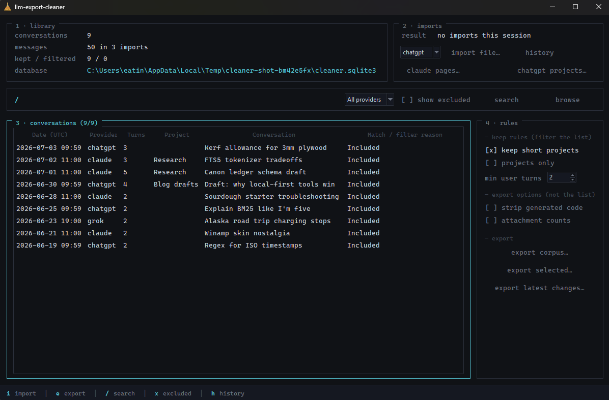

# LLM Export Cleaner

Your ChatGPT, Claude, and Grok exports are mostly metadata. LLM Export
Cleaner strips them into a clean, searchable library on your own machine
and exports transcripts you can actually read — or hand straight to an
LLM. No cloud, no API keys, no model calls, no dependencies.



It incrementally merges overlapping exports (nothing is ever deleted),
filters low-value conversations with visible, reversible rules, full-text
searches everything, and writes plain text, Markdown, JSON, or JSONL —
each with an audit manifest. Raw exports remain external; the cleaned
SQLite library is stored at:

```text
%LOCALAPPDATA%\LLM Export Cleaner\cleaner.sqlite3
```

## Quick start

**Windows, no Python needed:** download `LLMExportCleaner-Windows.zip`
from the Releases page, extract it, and run `Install.cmd`. It installs to
your user folder and creates Desktop and Start Menu shortcuts.

**From source** (Windows/macOS/Linux, Python 3.11+ with tkinter):

```bash
git clone https://github.com/eatinCrayonz/llm-export-cleaner
cd llm-export-cleaner
pip install -e .
llm-export-cleaner-app     # desktop app
llm-export-cleaner --help  # CLI
```

## Desktop workflow

The desktop app uses a terminal-style layout of numbered panels: **1 ·
library** (stats), **2 · imports**, a `/` search line, **3 ·
conversations**, and **4 · rules**, where cleaning rules are toggled
live and take effect immediately.

1. Select the provider and import its JSON export (panel 2).
2. Toggle cleaning rules (panel 4).
3. Search or browse retained conversations; excluded rows appear dimmed
   with their filter reason when **show excluded** is on.
4. Export the complete cleaned corpus, only the latest import's changes,
   or just the selected rows.

Keyboard: `i` import · `e` export · `/` search · `x` show
excluded · `h` history. Changing the provider dropdown re-runs the
current search or browse immediately. The conversation table supports extended
selection: `Ctrl+click` toggles rows, `Shift+click` selects ranges, and
`Ctrl+A` selects every currently displayed row. **export selected…**
writes only those conversations, in their visible table order, using
the active rules.

The default rules require two user turns (which also drops single-exchange
conversations), while preserving short Project conversations. Filtering is reversible:
the canonical cleaned record remains in the database with explicit exclusion
reasons.

## Incremental imports

Every source file is hashed. Exact re-imports are no-ops. Overlapping exports
merge by provider conversation and message IDs; only new or genuinely changed
records are rewritten and re-filtered. Absence from a later export never deletes
an older conversation.

## Search

SQLite FTS5 indexes titles plus user and assistant text. Search defaults to the
selected profile's included corpus; **show excluded** reveals excluded
conversations and their reasons.

## Recovering Project names

Claude's export ships Project names automatically: the `projects` folder that
arrives beside `conversations.json` is read during import, so keep the export
folder together. What no export contains is filled in by copying a JSON
response out of the provider's own website — local, manual, no API key:

1. In the provider's web app, press **F12**, open **Network**, select
   **Fetch/XHR**, and reload the page.
2. Click the request named below and copy its full **Response** JSON.
3. Paste it into the matching dialog in the app.

| Provider | Network request | App button | Provides |
| --- | --- | --- | --- |
| Claude | `conversations_v2` (open a Project first) | **claude pages…** | conversation-to-Project links |
| ChatGPT | `gizmos/snorlax/sidebar` | **chatgpt projects…** | Project names |

The asymmetry is the providers': Claude's export has Project names but no
membership, ChatGPT's has membership but no names. If a response reports
another page (`has_more: true` or a non-null `cursor`), copy and import each
page. These responses can include account identifiers — they stay local and
only IDs and names are kept, but do not publish the raw copies.

## Clean exports

Plain text, Markdown, JSON, and JSONL outputs contain only the documented canonical fields.
Plain text is the default for human or LLM reading: it omits merge-only IDs and
constant branch flags while retaining conversation boundaries, provider, date,
Project name, speaker roles, timestamps, and text. Delimiter-like lines inside
messages are prefixed with a backslash so conversation boundaries remain
unambiguous. Markdown remains available as an equivalent transcript extension;
JSON/JSONL remain available for structured pipelines. Every
output receives a companion `*-manifest.json` with source sizes, import count,
profile, export mode, conversation/message counts, and output bytes.

An export option can optionally remove fenced code generated by assistants.
The surrounding explanation and conversation remain, code-only turns become
`[Generated code removed]`, inline code remains, and user messages are not
modified. The original code stays in SQLite, so this output choice is fully
reversible.

See [the canonical schema](docs/canonical-schema.md) and
[Windows application instructions](docs/windows-application.md).

## Development

```powershell
python -m unittest discover -s tests -v
python -m llm_export_cleaner.cli --help
```
